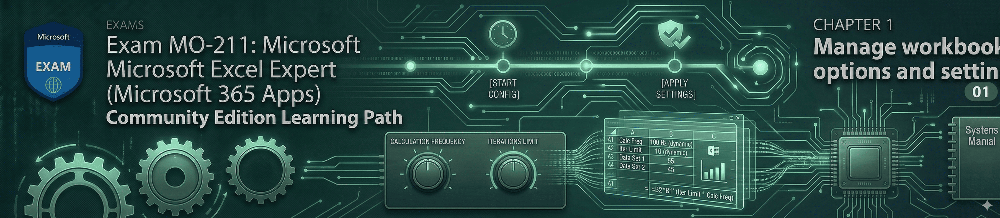

# Module 01: Manage Workbook Options and Settings (10–15%)

This module focuses on the infrastructure, security, and connectivity of Microsoft Excel workbooks. As an Excel Expert, you aren't just filling cells; you are managing the environment in which data lives. We begin by mastering the movement of automation through the **Visual Basic Editor (VBE)** and establishing robust data pipelines by **referencing external workbooks** to create a "Single Source of Truth."

You will also learn to navigate the high-stakes world of **Workbook Security and Governance**. This involves mastering the **Trust Center** to safely enable macros, implementing multi-layered protection—ranging from **cell-level locking** to **workbook structure constraints**—and ensuring data integrity through **version management**. Finally, we optimize performance for large-scale datasets by fine-tuning **calculation options**, including manual triggers and iterative logic, ensuring your models remain responsive even under heavy data loads.

-----

## 📂 Module Contents

### [1.1 Copy Macros](https://www.google.com/search?q=./1.1-copy-macro.md)

  * Navigating the Visual Basic Editor (VBE) and Project Explorer.
  * Moving and copying modules between workbooks via drag-and-drop or `.bas` export/import.

### [1.2 Reference Data](https://www.google.com/search?q=./1.2-reference-data.md)

  * Creating external references to other workbooks and understanding path syntax.
  * Managing, updating, and breaking links via the Edit Links dialog.

### [1.3 Enable Macros](https://www.google.com/search?q=./1.3-enable-macro.md)

  * Configuring Trust Center settings and Macro Security levels.
  * Setting up **Trusted Locations** to bypass security warnings for known folders.

### [1.4 Workbook Versions](https://www.google.com/search?q=./1.4-workbook-versions.md)

  * Recovering unsaved work using the AutoRecover engine.
  * Managing, viewing, and restoring previous file states through **Version History**.

### [1.5 Restrict Editing](https://www.google.com/search?q=./1.5-restrict-editing.md)

  * Implementing "soft" restrictions like **Mark as Final** and **Read-Only Recommended**.
  * Using Encryption and Information Rights Management (IRM) for sensitive data.

### [1.6 Protect Worksheet and Ranges](https://www.google.com/search?q=./1.6-protect-worksheet-and-ranges.md)

  * The "Two-Step" protection workflow: Unlocking input cells and protecting the sheet.
  * Hiding proprietary formulas and using **Allow Users to Edit Ranges**.

### [1.7 Protect Workbook Structure](https://www.google.com/search?q=./1.7-protect-workbook-structure.md)

  * Locking the workbook "container" to prevent deleting, renaming, or moving tabs.
  * Strategic use of hidden sheets to protect background mapping tables.

### [1.8 Formula Calculation Options](https://www.google.com/search?q=./1.8-formula-calculation-options.md)

  * Toggling between **Manual and Automatic** calculation for performance optimization.
  * Enabling **Iterative Calculations** and setting **Precision as Displayed** for financial accuracy.
