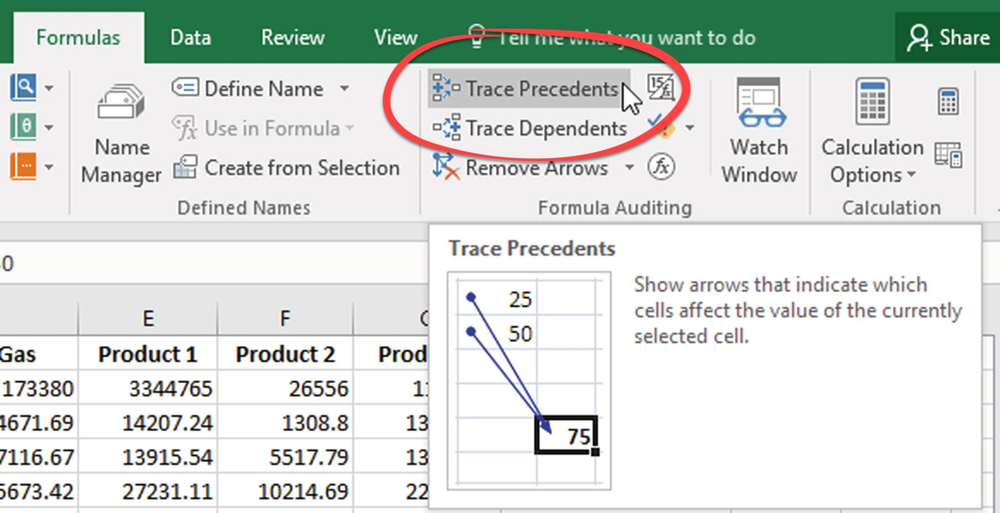

# 3.7 Troubleshoot Formulas and Audit Logic

In professional data analysis, a correct result is useless if you cannot prove how you calculated it. Formula Auditing tools allow you to visualize the relationships between cells, monitor distant calculations, and step through complex logic one operation at a time.

---

## Part 1: Tracing Cell Relationships

Excel formulas create a "web" of dependencies. Auditing arrows help you visualize this web.

### Where to find these tools:
Go to the **Formulas** tab on the Ribbon and look for the **Formula Auditing** group. This is your "Command Center" for troubleshooting.

### 1. Trace Precedents
* **What it does:** Shows arrows that point to the cells that provide data to the current formula (**`precedents`**).
* **Practical Example:** You have a **`Net Profit`** cell (B10) with the formula `=B5-B8`.
* **Action:** Select B10 and click **Formulas > Formula Auditing > Trace Precedents**.
* **Visual Result:** Blue arrows will appear pointing from **`Revenue`** (B5) and **`Expenses`** (B8) into your profit cell.
* **Official Docs:** [Display Relationship](https://support.microsoft.com/en-us/office/display-the-relationships-between-formulas-and-cells-a59bef2b-3701-46bf-8ff1-d3518771d507)

### 2. Trace Dependents
* **What it does:** Shows arrows pointing to the formulas that rely on the current cell (**`dependents`**).
* **Practical Example:** You are about to delete a **`Tax Rate`** cell (C1). You want to know which formulas will break if you do.
* **Action:** Select C1 and click **Formulas > Formula Auditing > Trace Dependents**.



---

## Part 2: The Watch Window

In large workbooks, your "Input" cells (like `Unit Price`) might be on one tab, while your "Goal" cells (like `Total Margin`) are on a completely different sheet. The **Watch Window** allows you to monitor a cell's value without scrolling back and forth.

* **Location:** **Formulas** tab > **Formula Auditing** group > **Watch Window**.
* **Practical Example:** You are adjusting **`Shipping Costs`** on the "Data" tab, but you need to see how it affects the **`EBITDA`** on the "Executive Summary" tab.
* **Action:** 1. Go to the Summary tab and select the `EBITDA` cell.
    2. Click **Watch Window > Add Watch**.
* **Result:** A floating window appears. As you change shipping costs on the other tab, you can see the `EBITDA` value update live in the small window.
* **Official Docs:** [Watch Window](https://support.microsoft.com/en-us/office/watch-a-formula-and-its-result-by-using-the-watch-window-d72fc6f3-4c9d-4c13-bd15-bb074ba7c784)

---

## Part 3: Validate with Error Checking Rules

Excel performs "Background Error Checking." If a formula breaks a rule, a small **green triangle** appears in the top-left corner of the cell.

* **Location:** **Formulas** tab > **Formula Auditing** group > **Error Checking**.
* **Common Error Rules:**
    1. **Inconsistent Formula:** Your formula in row 10 is different from the ones around it.
    2. **Formula Omits Adjacent Cells:** You summed `A1:A5`, but there is a number in `A6` you missed.
* **Official Docs:** [Error Checking Rules](https://support.microsoft.com/en-us/office/detect-formula-errors-in-excel-3a8acca5-1d61-4702-80e0-99a36a2822c1)

---

## Part 4: Evaluate Formula (The Slow-Motion Replay)

This is the most powerful tool for debugging complex, nested formulas (like a `VLOOKUP` inside an `IF` statement). It breaks the formula down and calculates it step-by-step.

* **Location:** **Formulas** tab > **Formula Auditing** group > **Evaluate Formula**.
* **Practical Example:** Your formula `=IF(VLOOKUP(A1, B1:C10, 2, 0) > 100, "High", "Low")` is returning an error.
* **Action:** Select the cell and click **Evaluate Formula**. The dialog opens with the full formula displayed and the **next sub-expression to be evaluated underlined**.
* **Process:**
    1. The dialog opens with `VLOOKUP(A1, B1:C10, 2, 0)` underlined — Excel is showing you what it will resolve next, but has not resolved it yet.
    2. Click **Evaluate**. The underlined `VLOOKUP(...)` is replaced with its result (e.g., `150`), and the next sub-expression (`150 > 100`) becomes underlined.
    3. Click **Evaluate** again. The underlined comparison is replaced with `TRUE`, and the next chunk to evaluate (the surrounding `IF(...)`) becomes underlined.
    4. Click **Evaluate** one more time. Excel returns the final result (`"High"`) and the **Evaluate** button changes to **Restart** so you can step through the formula again from the top.
* **Step In / Step Out:** When the underlined expression itself references another cell that contains a formula, the **Step In** button drops into that cell's formula, lets you evaluate it independently, and then **Step Out** returns you to the original expression with the resolved value substituted in.
* **Official Docs:** [Evaluate Formula](https://support.microsoft.com/en-au/office/evaluate-a-nested-formula-one-step-at-a-time-59a201ae-d1dc-4b15-8586-a70aa409b8a7)


---

## Part 5: Show Formulas (X-Ray Mode)

Sometimes you need to see *every* formula on a sheet at once—for documentation, code review, or hunting down a hard-coded value buried inside a column of `=` signs.

* **Toggle:** Press **`Ctrl` + `` ` ``** (the grave accent, top-left of the keyboard, same key as `~`).
* **Ribbon equivalent:** **Formulas** tab > **Formula Auditing** > **Show Formulas**.
* **Effect:** Every cell that contains a formula displays the formula text instead of the calculated result. Column widths automatically widen so the text fits.
* **Toggle off:** Press the same shortcut again, or click **Show Formulas** a second time.

> [!TIP]
> When **Show Formulas** is on, hard-coded numbers stand out instantly because they appear identical to formulas (no `=`). This is the fastest way to spot a number someone typed over a formula by accident.

* **Official Docs:** [Display or hide formulas](https://support.microsoft.com/en-us/office/display-or-hide-formulas-f7f5ab4e-bbc1-4cef-a9a8-be8a002c3877)

---

## Part 6: Removing Auditing Arrows

After tracing precedents and dependents on a complex sheet, you can end up with a tangle of blue and red arrows. Clear them selectively:

* **Formulas** > **Formula Auditing** > **Remove Arrows** — clears every auditing arrow on the sheet at once.
* Click the **dropdown** next to **Remove Arrows** for surgical control:
    * **Remove Precedent Arrows** — removes only the arrows pointing *into* cells.
    * **Remove Dependent Arrows** — removes only the arrows pointing *out of* cells.

Arrows are visual overlays only; removing them does not change any formulas.

---

## Part 7: Trace Error (Following the Failure Upstream)

When a cell shows an error like `#DIV/0!` or `#VALUE!`, the actual *source* of the problem may be several formulas upstream. **Trace Error** draws arrows from the broken cell back through the dependency chain to the originating cell.

* **Action:** Select the cell displaying the error.
* **Path:** **Formulas** > **Formula Auditing** > **Error Checking** dropdown > **Trace Error**.
* **Visual Result:** Red arrows show the path of the error; blue arrows show clean precedents that are *not* the problem.

This is invaluable when an error has propagated down a long column of dependent formulas and you need to find the one cell that started it.

---

## Part 8: Error Checking Dialog vs. Background Error Checking

Excel has **two** complementary error-checking systems:

### Background Error Checking (the green triangles)
* Runs continuously while you work.
* When a cell breaks an error rule (inconsistent formula, omitted adjacent cells, number stored as text, etc.), Excel paints a **small green triangle** in the top-left corner of the cell.
* Click the cell, then click the **yellow caution icon** that appears next to it for inline options.
* **Configure / disable** rules at: **File** > **Options** > **Formulas** > **Error checking rules**.

### Error Checking Dialog (the guided walk-through)
* **Path:** **Formulas** > **Formula Auditing** > **Error Checking**.
* Opens a modal dialog that steps through every flagged cell on the sheet, one at a time.
* Buttons inside the dialog:
    * **Previous / Next** — navigate between flagged cells.
    * **Show Calculation Steps…** — opens the **Evaluate Formula** window pre-loaded with the current error.
    * **Ignore Error** — dismisses the green triangle for this cell only.
    * **Edit in Formula Bar** — drops your cursor into the formula bar to fix the cell directly.
    * **Help on this error** — opens Microsoft's documentation for the specific error type.

---

## Part 9: Error Types Reference

| Error | Meaning | Typical Cause |
| :--- | :--- | :--- |
| `#N/A` | Value not available | A lookup function (`VLOOKUP`, `XLOOKUP`, `MATCH`) found no match. |
| `#VALUE!` | Wrong argument type | Passing text where a number is expected (e.g., `="abc"+1`), or a range where a single value is expected. |
| `#REF!` | Reference to a deleted cell | A cell or column the formula referenced was deleted; the formula now points "nowhere." |
| `#DIV/0!` | Division by zero | The divisor evaluates to `0` or to an empty cell. |
| `#NAME?` | Unrecognized function or named range | Misspelled function (`=SUMM(A1:A5)`), missing add-in, or a named range that no longer exists. |
| `#NUM!` | Numeric overflow or impossible math | Result too large to represent, or invalid input (e.g., `=SQRT(-1)`, `=DATE(99999, 1, 1)`). |
| `#NULL!` | Invalid range intersection | Using the space operator between two ranges that do not actually intersect (e.g., `=SUM(A1:A5 C1:C5)`). |
| `#SPILL!` | Dynamic-array spill blocked | A dynamic array tried to spill into a range that already contains values, a merged cell, or extends past the worksheet edge. |
| `#CALC!` | Calculation engine error | A dynamic array or `LAMBDA` returned an empty array, a nested array, or an unsupported pattern. |

* **Official Docs:** [Detect errors in formulas](https://support.microsoft.com/en-us/office/detect-errors-in-formulas-3a8acca5-1d61-4702-80e0-99a36a2822c1)

---

## Part 10: Clean Error Handling with `IFERROR` and `IFNA`

Showing raw `#N/A` or `#DIV/0!` to a stakeholder is unprofessional. Wrap risky formulas in an error-handler.

### `IFERROR` — Catches *every* error type
```excel
=IFERROR(VLOOKUP(A2, Customers, 3, FALSE), "Not found")
=IFERROR(B2/C2, 0)
```
Use when you want a single fallback for *any* failure (lookup miss, type mismatch, divide-by-zero, etc.).

* **Official Docs:** [IFERROR function](https://support.microsoft.com/en-us/office/iferror-function-c526fd07-caeb-47b8-8bb6-63f3e417f611)

### `IFNA` — Catches *only* `#N/A`
```excel
=IFNA(VLOOKUP(A2, Customers, 3, FALSE), "New customer")
```
Use when you want lookup misses to show a friendly label *but still want other errors* (`#REF!`, `#VALUE!`) to surface so you can fix them. `IFERROR` would mask those genuine bugs; `IFNA` lets them through.

* **Official Docs:** [IFNA function](https://support.microsoft.com/en-us/office/ifna-function-6626c961-a569-42fc-a49d-79b4951fd461)

> [!TIP]
> Prefer `IFNA` over `IFERROR` for lookups. Hiding a `#REF!` from a deleted column behind `"Not found"` is how silent bugs ship to production dashboards.

---

## 💡 Troubleshooting Shortcuts

| Shortcut | Action |
| :--- | :--- |
| **`Ctrl` + `[`** | Select Precedents (jump to the source cells) |
| **`Ctrl` + `]`** | Select Dependents (jump to the formulas using this cell) |
| **`Ctrl` + `` ` ``** | **Show Formulas** (Toggles between results and the raw code) |
| **`F9`** | Evaluate a *highlighted* portion of a formula in the formula bar |
| **`Shift` + `F9`** | Recalculate the **active sheet** only |
| **`F2`** | Edit the active cell with precedent cells highlighted in colour |
