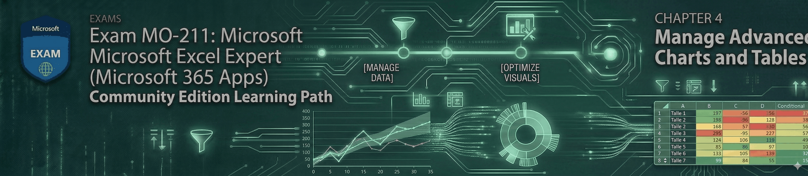

# Module 04: Manage Advanced Charts and Tables (25–30%)

This module is where your Excel work becomes **presentation-grade** and **decision-ready**. The MO-211 exam expects you to go beyond “insert a chart” and prove you can **choose the right visualization**, **tune it for clarity**, and **build interactive summaries** using **PivotTables** and **PivotCharts**.

You’ll master advanced chart types that test both your technical control and your data storytelling—especially **dual-axis (secondary axis)** visuals and modern statistical/relationship charts like **Box & Whisker**, **Histogram**, **Waterfall**, **Funnel**, **Combo**, and **Sunburst**. These aren’t just “nice charts”; they are the exact kinds of visuals used in real-world executive reporting and are explicitly part of MO-211-aligned training resources.
Then we shift into Excel’s analytical powerhouse: **PivotTables**. You’ll learn how to construct them properly, refine field layouts, add **slicers** for interactive filtering, group data into meaningful buckets, create **calculated fields**, and tune **Value Field Settings** to express insights as running totals, percentages, ranks, and more. Finally, you’ll turn those PivotTables into **PivotCharts**, style them consistently, and drill into the underlying details when a number looks suspicious or needs explanation. 
By the end of this module, you won’t just “make charts”—you’ll build interactive dashboards and analytical reports that look like they came out of a finance or BI team.

***

## 📂 Module Contents

### ./4.1-dual-axis-charts.md

*   When (and when **not**) to use a **secondary axis** for mixed scales (e.g., revenue vs. margin %).
*   Converting series types (column → line) and matching axis titles/formatting for clarity.

### ./4.2-advanced-chart-types.md

*   Creating and modifying **Box & Whisker**, **Histogram**, **Waterfall**, **Funnel**, **Combo**, and **Sunburst** charts.
*   Practical formatting: bins, quartiles/outliers, totals/subtotals in waterfalls, and hierarchy readability. 

### ./4.3-pivottables-core.md

*   Creating PivotTables and adjusting layouts for clean reporting.
*   Modifying field selections and core PivotTable options (layout, totals, refresh behavior).

### ./4.4-pivottables-advanced.md

*   Adding **slicers** and using them like dashboard controls.
*   Grouping PivotTable data (dates and numeric buckets).
*   Adding **calculated fields** to create measures like Profit, Margin, and Variance.

### ./4.5-value-field-settings.md

*   Switching summarization (Sum / Count / Average) correctly.
*   “Show Values As”: % of totals, running totals, rank, difference from, and more.
*   Applying number formats the *PivotTable-correct* way (so formatting persists).
  
### ./4.6-pivotcharts.md

*   Creating PivotCharts from PivotTables and manipulating chart field buttons.
*   Applying consistent styles and layouts for professional presentation.
*   Drilling into PivotChart/PivotTable details (expand/collapse + show underlying records).
  
### ./4.7-practice-lab.md

*   A single “sales + profit” dataset used to:
    *   build PivotTables + slicers,
    *   configure Value Field Settings,
    *   and produce all required advanced chart types.

### ./4.8-exam-drills.md

*   Timed, exam-style micro-tasks (e.g., “Set as Total” in Waterfall, group dates by quarters, convert series to secondary axis, create calculated field Margin).

***

## ✅ What You Must Be Able To Do (Exam Lens)

### Advanced Charts

*   Build and correctly label **dual-axis** charts (secondary axis).
*   Create and modify: **Box & Whisker**, **Combo**, **Funnel**, **Histogram**, **Sunburst**, **Waterfall**.
  
### PivotTables

*   Create PivotTables and refine field layout quickly.
*   Add slicers, group data, add calculated fields, and configure Value Field Settings.

### PivotCharts

*   Create, style, adjust options, and drill into details confidently. 

***
